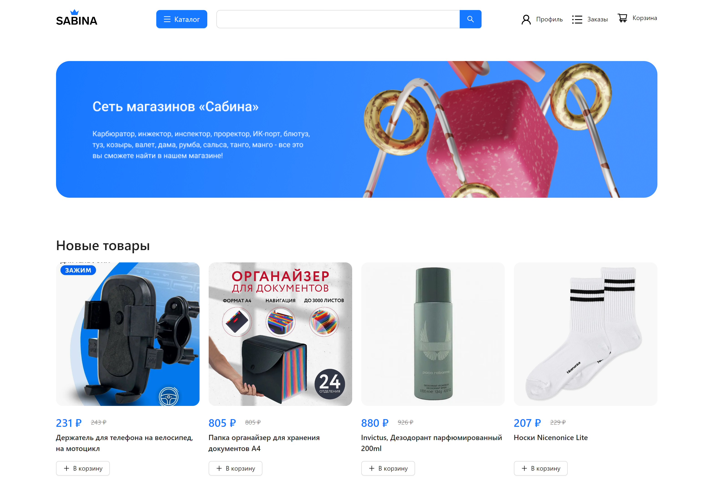

[](./images)

# sabina-server
This is the server API of the Sabina online store using Flask and MongoDB. <br/>
The client part is in this repository: https://github.com/iHelops/sabina-client

## This application uses
- [`Flask`](https://flask.palletsprojects.com/ "`Flask`")
- [`MongoDB`](https://www.mongodb.com/ "`MongoDB`")


## Getting started
To get the client running locally:

- Clone this repo
- `pip install -r requirements.txt` to install all req'd dependencies
- `python __index__.py` to start the local server

<br/>

```
Warning: this project is quite old, so there is quite a lot of bad code in it.
```
